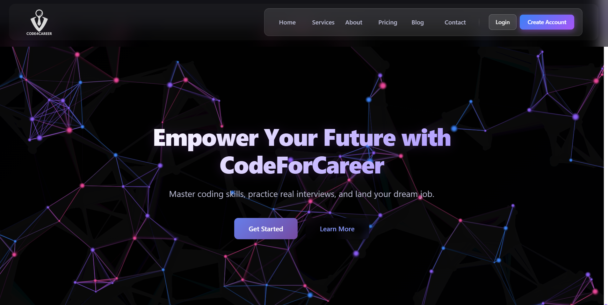

# 🚀 CodeForCareer  
### *AI-Powered E-Learning & Career Development Platform*

---

## 🖼️ Project Sneak Peek

  
   
  <em>Login to unlock the full course dashboard!</em>

<!-- Replace with an animated GIF for a better effect! -->
<!--  -->

---

## ⚠️ 🔒 Important: Code Security Disclaimer

> **The complete source code for this project is maintained in a Private Repository.**
>
> This decision is made to protect proprietary logic, security credentials, and database configurations.
>
> This public-facing README and the **live deployment** are provided **exclusively for recruitment evaluation**. Recruiters and technical leads can freely explore the full functionality, UI/UX, and performance in real-time without needing access to the underlying source code.

---

## 🎯 Project Overview

**CodeForCareer** is a comprehensive, full-stack e-learning platform designed to bridge the gap between academic learning and industry requirements. It provides students with structured learning paths, interactive coding practice, AI-powered career assistance, progress tracking, and placement preparation tools within a unified ecosystem.

The application follows a secure client-server architecture with role-based access for students, instructors, and administrators, ensuring scalable content management and personalized learning experiences.

---

## 🔐 Explore the Platform in 3 Clicks

Because the homepage is intentionally minimal, **you must log in** to see the magic. Here's how:

1. 👉 Visit the **[Live Demo](https://codeforcareer.vercel.app/)**
2. 📝 Click on **Register** (or Login if you already have an account).
3. 🎉 Instantly access:
   - 📖 **Full Course Library**
   - 📊 **Personalized Dashboard**
   - 🎯 **Interactive Learning Modules**

---

## ✨ Features

<table>
<tr>
<td width="50%" valign="top">

### 🎓 Learning Platform
- 📚 Course Management (CRUD)
- 📖 Modules & Lessons
- 🎥 Video Lectures
- 🗺️ Learning Roadmaps
- 📂 PDFs & Notes
- 📑 Cheat Sheets
- 🔖 Bookmarks
- 🌐 External Resources

---

### 👨‍🎓 Student Experience
- 📊 Personalized Dashboard
- 📈 Progress Tracking
- 📝 Quizzes & Assessments
- 🏆 Certificates
- 💻 DSA Practice
- ⚡ Coding Challenges
- 📈 Performance Analytics

</td>

<td width="50%" valign="top">

### 🔐 Security & Platform
- JWT Authentication
- Role-Based Access Control
- bcrypt Password Hashing
- Protected Routes
- Cloudinary Media Storage
- Razorpay Payment Gateway

---

### 🤖 Career & Collaboration
- AI Resume Analyzer
- Skill Gap Analysis
- Career Roadmaps
- Interview Preparation
- Discussion Forums
- Student–Instructor Chat
- Socket.io Real-Time Messaging

---

### ⚙️ Administration
- Admin Dashboard
- Instructor Dashboard
- User Management
- Course Management
- Enrollment Tracking
- Revenue & Platform Analytics

</td>
</tr>
</table>
---

## 🛠️ Tech Stack

| Frontend | Backend | Database |
| :---: | :---: | :---: |
|    **React** |    Node.js |    MongoDB |
|    HTML |    Express 
|    CSS | | |
|    JavaScript | | |

---
### Additional Technologies
- **State Management:** Redux / Context API
- **Real-time:** Socket.io
- **Authentication:** JWT + bcrypt
- **Styling:** Tailwind CSS
- **Deployment:** Vercel (Frontend), Render/Heroku (Backend)
---

## 👨‍💻 Author

  
### **Satya Prem**
  

---

## 📬 A Note for Recruiters

Thank you for evaluating my work!

- The live deployment demonstrates my ability to architect full-stack applications with **React**, a strong emphasis on **security**, and a focus on **user experience**.
- If you require a private code walkthrough, architectural diagrams, or any additional technical documentation, please don't hesitate to reach out via my portfolio.

---

  Built with ❤️ 

